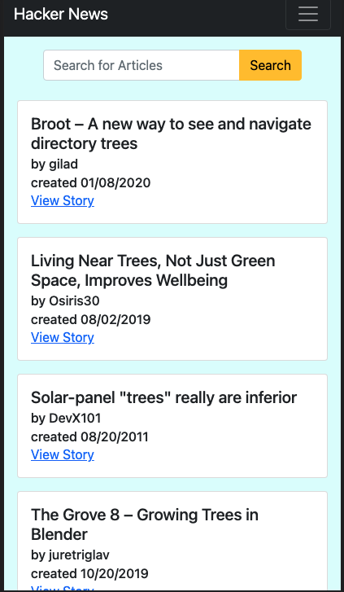
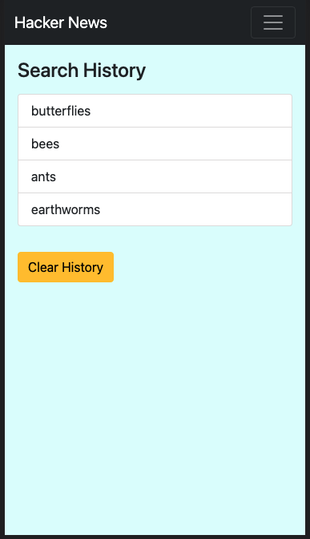

# Hacker News

  ## Badge

  

  ## Description

  A ReactJs and JS front-end application for searching Hacker News.
  
  ## Table of Contents
  
  - [Installation](#Installation)
  - [Usage](#Usage)
  - [Technologies](#Technologies)
  - [Questions](#Questions)
  - [License](#License)
  
  ## Installation

  ```bash
  To get started clone repo and save to desired location. From the command line, navigate to the 'hackernews' folder. Then, run npm i to install packages and npm start to get up and running.
  ```

  [Back to Table of Contents](#table-of-contents)
  
  ## Usage

  To use, enter a search term and click search.  News stories containing the search term will populate the page.  Searches are saved in session storage and session storage data populates the Search History page upon navigation to that page.

  View and try out the deployed application [here](https://jnel-221.github.io/hackerNews/#/hackerNews/)!

  Mobile-responsive views of Search and History pages:
  


  

  [Back to Table of Contents](#table-of-contents)
  
  ## Technologies
  ReactJS, React-router-dom, Axios, MomentJS, JavaScript, React-bootstrap, Bootstrap, and the Hacker News Algolia API.

  [Back to Table of Contents](#table-of-contents)
  
  
  ## Questions
  
  Questions? You can reach me by email at jennifer.nelson242@gmail.com. Feel free to check out additional projects at [my GitHub profile](https://github.com/jnel-221).

  [Back to Table of Contents](#table-of-contents)
  
  ## License

  This project is licensed under the terms of the [MIT](LICENSE) license.
  
  [Back to Table of Contents](#table-of-contents)